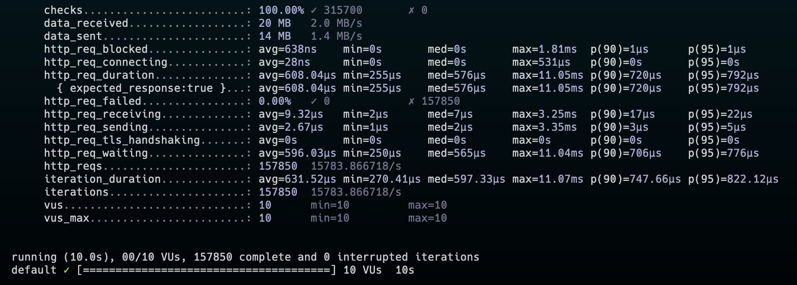
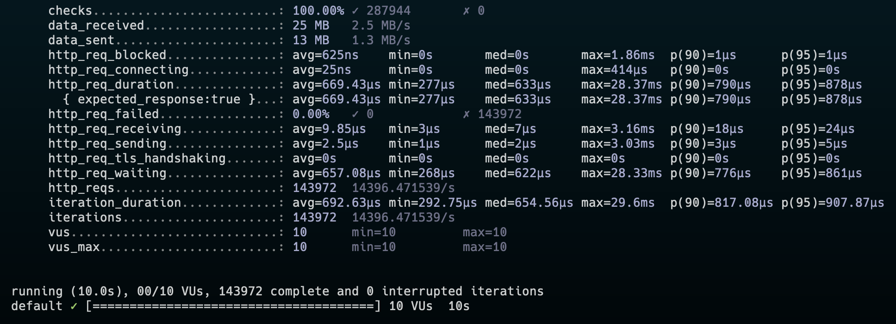
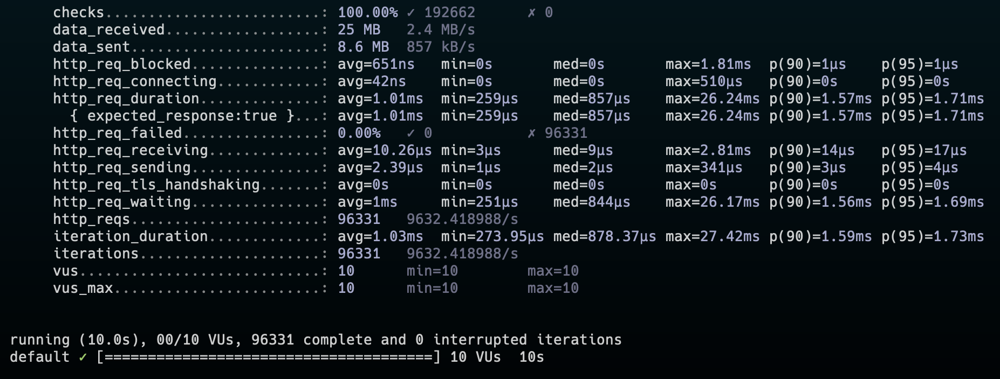

# Benchmarking some JS frameworks

This repo serves as basic speed comparisation between some JS frameworks with a realistic implementation. All test are executed by [K6](https://k6.io/) test framework.

## Frameworks tested

- Bun (Elysia)
- Node (Nuxt Backend - Nitro)
- Node (Express)

## Functional implementation

Simple API...

- [x] responding with a simple `hello` json object
- [ ] listing all results from a large local dataset.
- [ ] filering one entry from a large local dataset.
- [ ] adding basic auth (user and password)
- [ ] adding auth with external auth provider (Zytadel)

## Results

All test are executed on an MacBook Pro M2 2023 (10 Cores with 32GB). Test are executed against dev servers running on the same machine as the tests are executed.

Test are executed with the following settings:

- scenarios: (100.00%) 1 scenario, 10 max VUs, 40s max duration (incl. graceful stop):
- default: 10 looping VUs for 10s (gracefulStop: 30s)

### Elysia

iteration_duration: avg=149.54µs min=29.54µs med=119.66µs max=27.69ms p(90)=219.41µs p(95)=281.33µ

http_reqs: `657'071` (65'706.344377/s)

### Nuxt

iteration_duration: avg=203.5µs min=43.08µs med=173.87µs max=33.84ms p(90)=281.08µs p(95)=377µs

http_reqs: `486'581` (48'655.312051/s)

### Express

iteration_duration: avg=553.29µs min=98.54µs med=479.83µs max=14.23ms p(90)=911.58µs p(95)=996.29µs

http_reqs: `180'341` (18'033.338993/s)

## Running tests against containerized applications

All test are executed on an MacBook Pro M2 2023 (10 Cores with 32GB). Test containers are running on the same machine as the tests are executed.

### Elysia

http_reqs: `157'850` (15'783.866718/s)

### Nuxt

http_reqs: `143'972` (14'396.471539/s)

### Express

http_reqs: `96'331` (9'632.418988/s)

